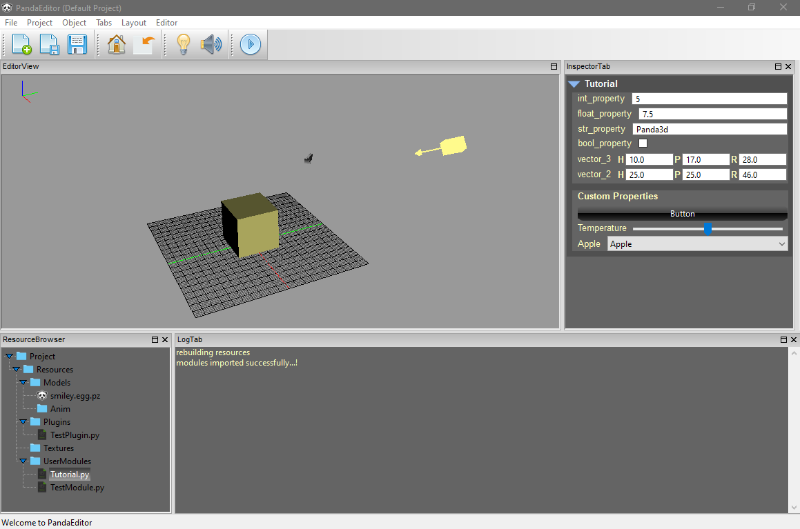

## A level / scene editor for Panda3d game engine with bare minimum features to provide an editor centric workflow.

### Features
1. Object manipulation
2. Support for runtime user modules 
3. Editor plugin support
4. Properties panel 
5. File browser
6. Console panel

### Short term planned features
1. Gizmos needs improvement
2. Object manipulation needs improvement
3. A scene graph
4. Undo / redo system
5. Code cleanup

### Dependencies
1. WxPython
2. Python Watch dog

### Install
1. clone / download this repo
2. run main.py

### Setting up a project 
* There is default project already setup, to create a new project **MainMenu > Project > Create New Project**

 
### Resources
To import resources (3d models, textures etc) **Resource browser > Import Resources**

**External resources**    
PandaEditor has support to append resources outside of your current project directory.  
Go to **Menu bar > Project > Append External Resources > select a resource directory** to append an external resource directory to your current project, PandaEditor will immediately start monitoring changes in any appended external resource directory.

### Object manipulation 
* control + right mouse button to rotate
* control + middle mouse to dolly
* control + left mouse button (drag) to zoom 

### User Modules
Are only executed in runtime mode, all changes made in run time (game mode) are reverted when game mode is exited. (see Resources > UserModules > Tutorial for a brief explaination)

### Editor Plugins
Are executed in both editor and game mode.

To create a new user module or editor plugin **Resource browser > (AnyFolder) > Create > UserModule or Editor Plugin.**
